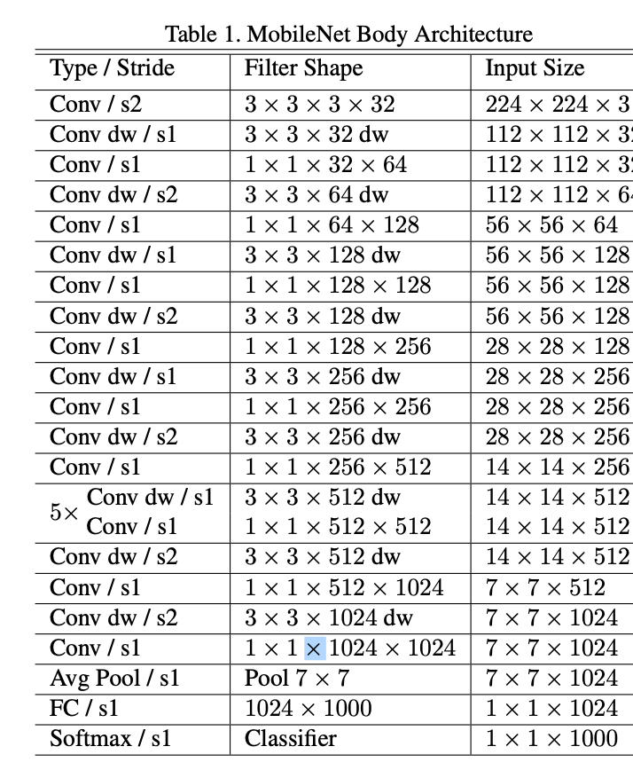

- [CNN](#cnn)
  - [Conv2d](#conv2d)
  - [CNN model arch](#cnn-model-arch)
  - [Evolvement](#evolvement)
  - [Normalization](#normalization)
  - [Conv2d Implementation](#conv2d-implementation)
- [AutoEncoder](#autoencoder)
  - [AutoEncoder](#autoencoder-1)
  - [TODO](#todo)
- [Adam](#adam)
- [Weight Decay](#weight-decay)

# CNN

## Conv2d
- Torch spec: https://pytorch.org/docs/stable/generated/torch.nn.Conv2d.html
- A good visualization: https://medium.com/data-science/conv2d-to-finally-understand-what-happens-in-the-forward-pass-1bbaafb0b148
- Basics
  - Input shape: `(N, C_in, H, W)`
  - Output shape: `(N, C_out, H, W)`
  - Kernel/weight shape: `(C_out, C_in, H_k, W_k)`
  - Flops: `N * H * W * H_k * W_k * C_in * C_out`
  - Dilation: increase receptive field without increasing num of params/flops
  - Stride: reduce spatial dimension
- Depthwise Separable Conv2d
  - A good visualization: https://www.youtube.com/watch?v=vVaRhZXovbw 
  - Apply single 2d filter per input channel, to capture spatial pattern within each channel
  - Apply another 1x1 conv across channels to learn cross channel interactions
  - Intention is to reduce compute complexity with minimal accuracy loss
  - In practice this may or may not run faster on modern GPUs given faster compute speed over mem bandwidth

## CNN model arch
- Commonly, (Conv2d + Norm + Act + Pooling) * N + MLP
  - Norm can be either BatchNorm (anchient) or LayerNorm
  - Activation includes ReLU, GeLU, etc
  - Pooling can be either min/max/attention pooling
- 
- Along with going deeper into the layer, gradually increase channel dim while reduce spatial dim. The intention is to extract spatial info into dense vector
- Spatial dimension reduction is achieved through stride and pooling

## Evolvement
1. A nice survey paper: A Comprehensive Survey of Convolutions in Deep Learning: Applications, Challenges, and Future Trends
2. AlexNet
   1. contribution, 1) largest CNN model, 2) optimized cuda implementation, 3) new arch
   2. ReLU: faster to converge comparing with non-saturating nonlinearity (e.g. tanh)
   3. CNN: gradually increasing channel dimension while reducing spatial dimension
3. InceptionNet
   1. introduced convolutional blocks, each of which includes multiple filter sizes to capture features at various scales
   2. improve both accuracy and computational efficiency
4. ResNet
   1. with depth further increasing, empirical results show not similar but even worse results than shallower models
   2. residual mapping likely makes the solver easier to learn identity or close to identity mapping
5. MobileNet
   1. depthwise separable convs, width and resolution multiplier 
   2. significant compute efficiency improvement, with small accuracy loss
6. EfficientNets
   1. more systematically thinking about balancing accuracy and cost through conv params
7. FaceNet
   1. e2e train a face embedding by carefully design loss function and triplet batch data

## Normalization
- Stablize training
- BatchNorm was versatile among AlexNet, ResNet, etc
- LayerNorm was invented afterward as a better alternative

## Conv2d Implementation
- As of today, cuDNN is likely the most efficient implementation
  - Note that, pytorch underlyingly run cuDNN's kernel, but the conv and bias are separate ones. It could be 2x slowdown if using bias, which is mem bandwidth bound
- The only opensource version of triton implementation is from torch inductor
  - https://github.com/pytorch/pytorch/blob/main/torch/_inductor/kernel/conv.py 
  - 2~3X slower than cuDNN, mainly due to Triton compiler's focus on transformer models

# AutoEncoder
Confusing math terms in loss function!
- `Distribution`: how likely each possible value of something is.

- `Sample`: select a value based on a distribution.

- `p(z | x)`: a conditional distribution. It describes the probability of each possible value of `z`, given a specific input `x`. The vertical bar `|` means “given.”

- `z ∼ p(z | x)`: means “`z` is sampled from the distribution `p(z | x)`.” In other words, `z` is chosen based on the probabilities defined by `p(z | x)`.

- `KL(P ‖ Q)`: the Kullback–Leibler divergence. A number that measures how different distribution `P` is from distribution `Q`. It is zero if the two are the same, and grows larger as they differ more.

- `E[...]`: stands for “expectation.” Computed as the sum of value weighted by the probability.

## AutoEncoder
- Train `python autoencoder/train.py`
- Eval `python autoencoder/eval.py`

## TODO
- Implement Variational Autoencoder
- Read difussional model
- Read stable difussion

# Adam
- first momentum
  - `m`: mean
  - `exp_avg`: exponential average `m = β₁ × m + (1 − β₁) × g`
  - If gradients point in a consistent direction, `m` accumulates.
- second momentum
    - `v`: variance
    - `exp_avg_sq`: exponential moving average of the square `v = β₂ × v + (1 − β₂) × g²`
      - It shows how “bouncy” or unstable the gradients are.
- update
    - `new_p = p − lr × m / √v`
    - `m` indicates direction: a larger `m` means a bigger step.
    - `v` measures noise: a larger `v` means a smaller step.

# Weight Decay
- Weight decay is a regularization technique that prevents overfitting by shrinking the weights toward zero during training.
  - w ← w − lr × λ × w
- What does regularization mean?
  - In math, it means adding a constraint or penalty to an optimization problem to make it well-behaved—or “regular.”
  - Regularization adds a penalty to the loss that discourages bad solutions, like overfitting.
    - Loss = MSE(y, ŷ) + λ × ||w||²
- Why does regularization help prevent overfitting?
  - Smaller weights = simpler functions = less overfitting
  - When weights are large, even a small change in input can cause a huge change in output.
  - This leads to a model that memorizes training data but fails on unseen data.