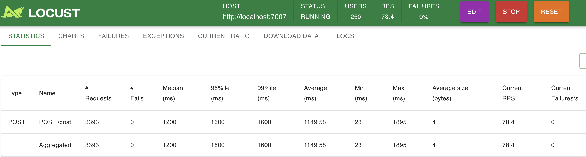
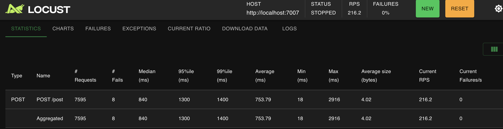

- [Toy Newsfeed](#toy-newsfeed)
  - [1. Tiny](#1-tiny)
  - [2. Web](#2-web)
  - [3. Backend](#3-backend)
  - [4. Load test](#4-load-test)
    - [Set up Prometheus and Grafana](#set-up-prometheus-and-grafana)
    - [max throughput of post service before scaling up](#max-throughput-of-post-service-before-scaling-up)
  - [5. Shard Post Service](#5-shard-post-service)
  - [6. Scale up TBD](#6-scale-up-tbd)

# Toy Newsfeed

## 1. Tiny
- [x] Newsfeed class implementation
- [x] Unit test 
- [ ][Low] CLI entrypoint

## 2. Web
- [x] Web interface and URL to run Newsfeed

## 3. Backend
- [x] Separate frontend (web) and backend
- [x] Separate feed and post services
- [ ][Mid] Correct logging, e.g. level, format, etc
- [ ][Low] Fix FastApi type for uids list[str] 

## 4. Load test
- [x] Build monitoring system
  - [x] QPS for each API
  - [x] Latency
  - [x] Error rate
- [x] Load test post services. Identify bottleneck
- [x] Load test web service iteslf, identify max QPS. 
  - [x] Increase num of worker. Check if max QPS changes
- [x] Enable multiple worker for Post service
- [x] Update all services to requires going through web service
  - [x] Call burn_cpu on each request with a random latency b/t 20~50ms
- [ ] Load test web service for post again and check max QPS

### Set up Prometheus and Grafana
1. brew install prometheus
2. brew install grafana
3. Config prometheus (checkout prometheus.yml)
4. Run Prometheus
  prometheus --config.file=./prometheus.yml
5. Run Grafana
  grafana-server --homepath "/usr/local/share/grafana"
  Or (grafana server --homepath "/opt/homebrew/opt/grafana/share/grafana")
6. Set up a Data Source in Grafana
   1. Open your browser to http://localhost:3000.
   2. Configuration → Data Sources → Add Data Source → Prometheus.
   3. URL field, put http://localhost:9090
7. Add Prometheus Instrumentation to FastAPI
   1. pip install prometheus-fastapi-instrumentator
   2. Checkout web_service.py
8. Monitor metrics
   1. Check Prometheus at http://localhost:9090/targets to see if your FastAPI app is “UP.”
   2. View metrics at http://localhost:9090/graph.
   3. Add query `rate(http_requests_total[1m]) * 60`

### max throughput of post service before scaling up

## 5. Shard Post Service
1. [x] Implement sharded service client
2. [x] Integrate sharded client with Web service and Feed service
3. [x] Test on UI and verify correctness
4. [ ] Write a e2e test upon real users: make couple posts (sharded version), and query feeds, verify correctness
5. [ ] Loadtest and check how much max QPS improves
   1. [ ] Spawm multiple post service as processed in the same host
   2. [ ] Spawm multiple post services across hosts

[TODO] check all the servers are up at the init time

## 6. Scale up TBD
1. Option 1 - sharding and load balance
   1. Request routing on web service, shard the backend
   2. Service discovery
   3. Load monitoring
   4. Implementation
      1. easiest: client round-robin
      2. 2nd easiest: client maintain a util
      3. reasonable: load polling
2. Option 2 - pull model using Kafka
