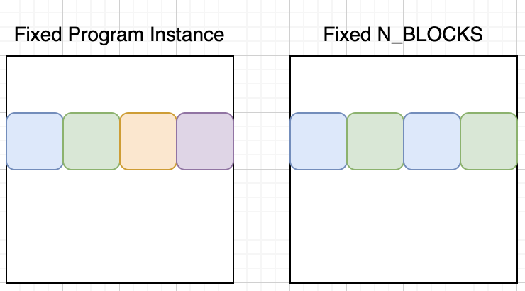

# Table of Content
- [Table of Content](#table-of-content)
- [Nsys](#nsys)
  - [Inspect nsys profile](#inspect-nsys-profile)
  - [Annotation](#annotation)
- [Profile Python Code](#profile-python-code)
  - [Profilers](#profilers)
  - [Overhead](#overhead)
  - [Timers](#timers)
  - [Thread, GIL, and Python Interpreter](#thread-gil-and-python-interpreter)
- [Triton Basics](#triton-basics)
  - [Threading Model](#threading-model)
  - [Layout Basics](#layout-basics)
  - [Somewhat-good-Practice](#somewhat-good-practice)
  - [Tiling strategy](#tiling-strategy)
  - [Torch profiler annotation](#torch-profiler-annotation)
  - [Triton syntax](#triton-syntax)
- [Numbers](#numbers)
  - [Bandwidth Test](#bandwidth-test)


****
# Nsys

## Inspect nsys profile
- To find a particular kernel, e.g. add2_bwd, 
  1. select cuda all streams, 
  2. click show in event view , 
  3. search for add2_bwd
  4. (can search either a kernel or block annotation)
- Nsys offers pretty handy event view in nested tree format!
- For a kernel, grid info could be useful


## Annotation
- nvtx.range_push() inserts a special event to cuda stream to mark the beginning of a range. nvtx.range_pop() inserts another special event to cuda stream to mark the end of a range. 

  - In nsys cuda stream view, the start time is the first kernel start time. The end time is the last kernel end time. Any python side duration (e.g. time.sleep()) is omitted. 

  - For multiple streams, nvtx.range_push() and nvtx.range_pop() insert events to each stream independently. The duration and annotation in nsys is also generated independently for each stream.

  - Checkout `nvtx.py`

- If using triton, kernel names are the exact triton function name

  

  
# Profile Python Code
## Profilers
1. Sampling based profiler: get stack traces at fixed time intervals, e.g.
    - `Scalene`: register signal handler for target python process, and record stack traces when signal is triggered, by C++
    - `py-spy`: fetches stack trace of a remote python process by virtual memory address, by rust
2. Trace based profiler: get stack traces and frame info for each function call
    - `yappi`: register hooks through python C API PyEval_SetProfile(), record frame and stack trace for each function call

## Overhead
- `Scalene` and `py-spy`: <10% based on reported results
- python trace based profiler: ~15x overhead
- c++ trace based profiler: ~10x overhead
```
cd perf/profiler
python setup.py build_ext --inplace
python benchmark_profiler.py

Baseline: 1.03 seconds
Python profiler: 16.00 seconds
{'duration:38': 1, 'task:33': 3, 'fibonacci:27': 65673000}
C++ profiler: 11.03 seconds
{'27:fibonacci': 65673000, '33:task': 3, '38:duration': 1}
```

## Timers
- `time.perf_counter()`: wall time
- `time.thread_time()`: cpu time
- `torch.cuda.synchronize()`: the behavior seems similar to spin lock. It blocks the thread, check ready, yields the GIL to other threads before checking again.


## Thread, GIL, and Python Interpreter
- Each thread gets its own PyThreadState that holds thread-specific data (like the current execution frame and exception state). When a thread runs, it enters the common interpreter loop (implemented in CPython’s ceval.c) to execute bytecode. Although the loop’s code is the same for every thread, each thread’s loop runs with its own context.
- Even though each thread executes the interpreter loop independently, the Global Interpreter Lock (GIL) ensures that only one thread’s loop can be executing Python bytecode at any given moment. So while conceptually each thread runs its own loop, in practice their execution is interleaved rather than truly parallel.
- When threads call into C extensions that release the GIL, they may run concurrently at the C level. However, when they return to Python code, they again contend for the GIL and re-enter their interpreter loop.

TODO
[ ] single threaded trace based profiler
[ ] store index instead of real name
[ ] multi-threaded trace based profiler
[ ] for each function record st and ed time only
[ ] generate both flamegraph and chrome trace
[ ] pass results from PyEval_SetTrace() function
[ ] get thread name
[ ] easy way to register for all threads on python 3.11


# Triton Basics
## Threading Model
(by ChatGPT)
- Cuda
  - `Thread`: the smallest unit of execution.
  - `Warp`: a group of 32 threads that execute instructions in SIMP fashion.
    - Warps enable efficient parallel execution within a block
  - `Block`: a group of warps that can share on-chip memory, and synchronize using barriers.
    - Blocks are scheduled and executed independently and in parallel
  - `Grid`: a group of blocks, running co

## Layout Basics
- a 2D data is usually shaped as `(M, N)`
- `BLOCK_SIZE` / `BLOCK_M` / `BLOCK_N`: 
  - number of data/rows/columns will be processed by a single program instance (i.e. block). Essentially controls tile size per instance
- `N_BLOCKS` / `M_BLOCKS` / `N_BLOCKS`: 
  - number of program instances launched along M and N dims. It determines the level of parallelism (Note that, each program instance itself runs multiple warps/threads in parallel as well).
- `grid`: 
  - usually equals to `(M_BLOCKS, N_BLOCKS)`
- `num_warps`: 
  - number of hardware warps per program instance. It determines the parallelism within a program instance.
  

## Somewhat-good-Practice
1. 2D grid doesn't neccessarily better perform 1D grid
```
################################################################################
#
#   Benchmark the performance of 1D and 2D grid layouts.
#            M    N    BLOCK_M    BLOCK_N    num_warps  time      time_torch
#      -------  ---  ---------  ---------  -----------  --------  ------------
#      4194304  480          1        256            1  8.093ms   7.777ms
#      4194304  480          2        256            1  8.117ms   7.777ms
#      4194304  480          4        256            1  8.148ms   7.776ms
#      4194304  480          8        256            1  8.130ms   7.776ms
#      4194304  480         64        256            1  25.525ms  7.776ms
#      4194304  480        256        256            1  28.131ms  7.776ms
#      4194304  480          1        512            2  7.814ms   7.776ms
#
#   - Intuitively, it might feel like 2D grid layout is faster due
#       to more parallelism. But it's not really the case at all!
#   - As long as the block size is chosen properly, 1D grid layout
#       can be as fast as 2D grid layout.
#   - Either paralleling on M or N dimensions is equally good.
#
################################################################################
```

2. Layout tuning for a tall-thin-shape matrix
```
################################################################################
#
#   Benchmark the performance of different layout.
#       Group            M    N    BLOCK_M    BLOCK_N    num_warps  time      time_torch
#       ---------  -------  ---  ---------  ---------  -----------  --------  ------------
#       BLOCK_N    4194304  480          1         32            1  37.806ms  7.776ms
#       BLOCK_N    4194304  480          1         64            1  20.161ms  7.776ms
#       BLOCK_N    4194304  480          1        128            1  10.098ms  7.776ms
#       BLOCK_N    4194304  480          1        256            1  8.084ms   7.776ms
#       BLOCK_N    4194304  480          1        512            1  7.809ms   7.776ms
#       BLOCK_N    4194304  480          1       1024            1  7.792ms   7.776ms
#
#       BLOCK_M    4194304  480          1        512            1  7.811ms   7.776ms
#       BLOCK_M    4194304  480          2        512            1  7.853ms   7.777ms
#       BLOCK_M    4194304  480          4        512            1  7.816ms   7.775ms
#       BLOCK_M    4194304  480         32        512            1  25.503ms  7.776ms
#       BLOCK_M    4194304  480        128        512            1  27.666ms  7.776ms
#
#       num_warps  4194304  480          1        512            1  7.810ms   7.776ms
#       num_warps  4194304  480          1        512            2  7.815ms   7.777ms
#       num_warps  4194304  480          1        512            4  7.784ms   7.777ms
#       num_warps  4194304  480          1        512            8  7.739ms   7.775ms
#       num_warps  4194304  480          1        512           16  9.209ms   7.775ms
#
#   For a tall-thin-shape matrix,
#   1. Not much difference between 1D and 2D grids
#   2. BLOCK_N is the most important factor. Need to be big enough to
#       - hide the memory access latency,
#       - better coalescing memory access,
#       - and compute parallelism.
#   3. BLOCK_M is kind of irrelevant, as long as it's not too small.
#   4. Usually num_warps=1 gets the best performance.
#       - Large num_warps doesn't make it faster but usually slower.
#       - It might because of preventing more parallelism on M axis.
#
################################################################################
```

3. Auto-tuning
```
################################################################################
#
#   Auto-tuning
#
#   Test:
#       Auto-tuned: M: 4194304, N: 480, time: 7.786ms
#
#   Takeaway:
#   1. triton.Config has default values
#       - num_stages=3
#       - num_warps=4
#   2. grid = lambda META:
#       - META can access all the arguments of the kernel, but not values from triton.Config
#       - for example, if arguments don't include num_warps, it cannot be accessed
#   3. autotune seems fast and accurate. Comparable to hand-tuned layouts
#
################################################################################
```

4. Heuristics 
```
################################################################################
#
#   Heuristics
#       Heuristics: M: 4194304, N: 480, time: 7.788ms
#
#   Seems handy and sufficiently efficient if has a good heuristic.
#
################################################################################
```

## Tiling strategy


1. Bottomline is, every single tile should be covered by one program instance
2. Fixed program instance: 
   - Each program instance (block) covers a fixed amount of work
   - The total num of program instance (block) varies
3. Fixed N_BLOCKS:
   - The total num of program instance (block) is fixed
   - Each program instance will process one or multiple tiles 
4. Comparison
   - Fixed program instance seems easier to implement. Each of which only need to deal with one tile. The num of program instance can be easily specified through grid (e.g. `[cdiv(M, BLOCK_M), cdiv(N, BLOCK_N)]`)
   - One drawback of fixed program instance is that, it might result into a huge number of program instances (blocks). It may potentially cause extra scheduling overhead just like excessively num of threads in OS? don't really know.
   - So far it seems not much difference between those two approaches. Might be wrong though due to very limited experience

## Torch profiler annotation
- Each launched kernel in torch profiler has metadata including grid and block.
- `grid	[2097152, 1, 1]`: 1D grid is used, with in total 2097152 program instances (blocks)
- `block [64, 1, 1]`: each block contains 2 warps, or 64 threads

## Triton syntax
- `tl.debug_barrier`: 
  - Force to synchronize all threads in a block.
  - Needed when load/write the same pointer (global memory). But accessing local tensor is fine.
```
# loop_1
for off in range(0, N, BLOCK_N):
  cols = off + tl.arange(0, BLOCK_SIZE)
  tl.store(Out + cols, out, mask=mask)

tl.debug_barrier # otherwise it's possible that two threads within the same bloc, while one read (in loop_2) happens before the other write (in loop_1)

# loop_2
for off in range(0, N, BLOCK_N):
  cols = off + tl.arange(0, BLOCK_SIZE)
  t = tl.load(Out + cols, mask=mask)
```

- `tl.constexpr`
  - Indicates that a kernel argument is a compile-time constant.
  - This allows the compiler to perform optimizations such as unrolling loops and simplifying control flow, since it can generate specialized code paths for different constant values.

- `do_not_specialize`
  - Prevents the Triton compiler from generating specialized kernel variants for specific arguments.

- `tl.cumsum()`
  - Can be magical!
  - e.g. compute starting offset for each chunk of data, thus parallel the computation and store 
  - e.g. when combined with `tl.where()`
    - a list of elements, some of which satisfy some requirements while some do not
    - the goal is to reorder the list so that satisfying elements are placed at the beginning while others at the end
    - `locations = tl.cumsum(satisfied)`
    - `locations = tl.where(satisfied, locations, reversed_locations)`
- `tl.load()` & `tl.store()`
  - Pointers don't have to be consecutive. 
  - Precomputing a tensor as pointers can achieve purposed reordering
  
# Numbers

## Bandwidth Test
1. HBM to SMEM
   - `python hbm_2_smem.py` 
   - H100: tested value: `2597GB/s`, reported value: `3TB/s`
2. Disk <> Host Mem
   1. Mem write to disk: `~500MB/s`
   2. Mem read from disk: `2~5GB/s`

- On H100
  - Dense matmul
    - [4k, 700] @ [700, 100k] ~1ms
    - [4k, 700] @ [700, 400k] ~4ms
  - Element-wise kernel
    - H100 memory bandwidth is 3TB
    - [4M, 480] (~8GB data read and then write) 8ms. Theoritical latency is 8/3000*2~=5ms