# Table of Content
- [Table of Content](#table-of-content)
- [Nsys](#nsys)
  - [Data Model](#data-model)
  - [NVTX Annotation](#nvtx-annotation)
  - [Inspect Nsys profile](#inspect-nsys-profile)
- [Profile Python Code](#profile-python-code)
  - [Profilers](#profilers)
  - [Overhead](#overhead)
  - [Timers](#timers)
  - [Thread, GIL, and Python Interpreter](#thread-gil-and-python-interpreter)
- [Triton Basics](#triton-basics)
  - [Threading Model](#threading-model)
  - [Layout Basics](#layout-basics)
  - [Somewhat-good-Practice](#somewhat-good-practice)
  - [Tiling strategy](#tiling-strategy)
  - [Torch profiler annotation](#torch-profiler-annotation)
  - [Triton syntax](#triton-syntax)
- [Overlap Compute Streams](#overlap-compute-streams)
  - [Experiment Results](#experiment-results)
  - [CUDA execution hierarcy](#cuda-execution-hierarcy)
  - [Observibility](#observibility)
- [Numbers](#numbers)
  - [Bandwidth Test](#bandwidth-test)
- [D2D Local Memcpy](#d2d-local-memcpy)
  - [Benchmarks](#benchmarks)
  - [Execution Flow](#execution-flow)
  - [MLP - Memory Level Parallelism](#mlp---memory-level-parallelism)
    - [Asynchronous](#asynchronous)
    - [cp.async](#cpasync)
  - [Profiling](#profiling)
  - [Bottleneck analysis](#bottleneck-analysis)
    - [Peak overall tput 3TB/s: bounded by global memory bandwidth](#peak-overall-tput-3tbs-bounded-by-global-memory-bandwidth)
    - [Single SM hits at 47GB/s: bounded by LSU bandwidth](#single-sm-hits-at-47gbs-bounded-by-lsu-bandwidth)
    - [Single SM with smaller num of threads: likely bounded by per-warp instruction issue rate](#single-sm-with-smaller-num-of-threads-likely-bounded-by-per-warp-instruction-issue-rate)
    - [Per-SM tput decreases with more SMs](#per-sm-tput-decreases-with-more-sms)
    - [Per-SM tput decreases faster with more SMs for n\_threads=512 than n\_threads=1024](#per-sm-tput-decreases-faster-with-more-sms-for-n_threads512-than-n_threads1024)
  - [Cuda d2d optimization](#cuda-d2d-optimization)
- [D2D memcpy nvlink](#d2d-memcpy-nvlink)
  - [Execution Flow](#execution-flow-1)
  - [Bottleneck Analysis](#bottleneck-analysis-1)
- [D2D memcpy nvlink handshake](#d2d-memcpy-nvlink-handshake)
  - [Single SM tput](#single-sm-tput)
    - [n\_channels](#n_channels)
    - [Staging buf size](#staging-buf-size)
    - [cp.async](#cpasync-1)
    - [Rotation buffer](#rotation-buffer)
  - [Total tput](#total-tput)


****
# Nsys

## Data Model
- Each event is a timespan, with start, end and duration
  - NVTX event: tags from user's python code annotated by nvtx, e.g. `torch.cuda.nvtx.range_push("l1")`
  - Cuda event: cuda kernels
  - Other event: specified by `-t`, e.g. `futex` from OS runtime, `Call to cudaEventRecord` from Cuda API, etc
- Events are categorized by
  - CPU threads
    - fwd thread, bwd thread, etc
    - Each thread is further breakdown by NVTX, NCCL, CUDA API, OS runtime, etc
  - All streams
    - Compute stream, comm stream, mem stream, etc
    - Each stream is further breakdown by NVTX, kernel, memory, etc
      - Kernel is further breakdown by type, e.g. matmul, all_reduce, etc
      - Similarly to memory, e.g. memset, h2d, d2h, etc

## NVTX Annotation
- `nvtx.range_push()` inserts a special event to cuda stream to mark the beginning of a range. `nvtx.range_pop()` inserts another special event to cuda stream to mark the end of a range. 

- Each annotation creates events on both CPU threads and GPU streams
- One annotation creates one event on Cpu thread
  - Only created for the current Cpu thread
  - Event start time, end time and duration match with Cpu code execution time. For example, a `time.sleep()` will be reflected 
- One annotation creates multiple events, each for one Cuda stream
  - In nsys cuda stream view, the start time is the immediate next kernel start time. The end time is the last kernel end time. 
  - Any python side duration (e.g. `time.sleep()`) will be omitted. 
  - For multiple streams, nvtx.range_push() and nvtx.range_pop() insert events to each stream independently. The duration and annotation in nsys is also generated independently for each stream.
- Checkout examples in `nvtx.py`

- If using triton, kernel names are the exact triton function name

## Inspect Nsys profile
- First figure out which row to look at. GPU stream, which stream? CPU thread, which thread?
- For a GPU stream, wanted to check kernels or NVTX annotations?
- Events view is very handy. It's time ordered, and shows nested tree structure
  - Check events view by right click the row. 
  - Right click on the stream to show all events, or right click NVTX to show all the NVTX events
- To find a particular kernel, e.g. add2_bwd, 
  1. select cuda all streams 
  2. click show in event view
  3. search for add2_bwd
  4. right click the event and click zoom to selected event
- Look at timeline view to check durations and bubbles

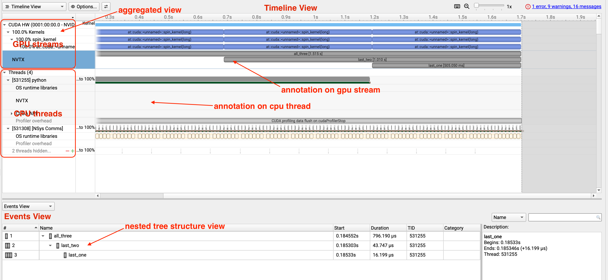


  

  
# Profile Python Code
## Profilers
1. Sampling based profiler: get stack traces at fixed time intervals, e.g.
    - `Scalene`: register signal handler for target python process, and record stack traces when signal is triggered, by C++
    - `py-spy`: fetches stack trace of a remote python process by virtual memory address, by rust
2. Trace based profiler: get stack traces and frame info for each function call
    - `yappi`: register hooks through python C API PyEval_SetProfile(), record frame and stack trace for each function call

## Overhead
- `Scalene` and `py-spy`: <10% based on reported results
- python trace based profiler: ~15x overhead
- c++ trace based profiler: ~10x overhead
```
cd perf/profiler
python setup.py build_ext --inplace
python benchmark_profiler.py

Baseline: 1.03 seconds
Python profiler: 16.00 seconds
{'duration:38': 1, 'task:33': 3, 'fibonacci:27': 65673000}
C++ profiler: 11.03 seconds
{'27:fibonacci': 65673000, '33:task': 3, '38:duration': 1}
```

## Timers
- `time.perf_counter()`: wall time
- `time.thread_time()`: cpu time
- `torch.cuda.synchronize()`: the behavior seems similar to spin lock. It blocks the thread, check ready, yields the GIL to other threads before checking again.


## Thread, GIL, and Python Interpreter
- Each thread gets its own PyThreadState that holds thread-specific data (like the current execution frame and exception state). When a thread runs, it enters the common interpreter loop (implemented in CPython’s ceval.c) to execute bytecode. Although the loop’s code is the same for every thread, each thread’s loop runs with its own context.
- Even though each thread executes the interpreter loop independently, the Global Interpreter Lock (GIL) ensures that only one thread’s loop can be executing Python bytecode at any given moment. So while conceptually each thread runs its own loop, in practice their execution is interleaved rather than truly parallel.
- When threads call into C extensions that release the GIL, they may run concurrently at the C level. However, when they return to Python code, they again contend for the GIL and re-enter their interpreter loop.

TODO
[ ] single threaded trace based profiler
[ ] store index instead of real name
[ ] multi-threaded trace based profiler
[ ] for each function record st and ed time only
[ ] generate both flamegraph and chrome trace
[ ] pass results from PyEval_SetTrace() function
[ ] get thread name
[ ] easy way to register for all threads on python 3.11


# Triton Basics
## Threading Model
(by ChatGPT)
- Cuda
  - `Thread`: the smallest unit of execution.
  - `Warp`: a group of 32 threads that execute instructions in SIMP fashion.
    - Warps enable efficient parallel execution within a block
  - `Block`: a group of warps that can share on-chip memory, and synchronize using barriers.
    - Blocks are scheduled and executed independently and in parallel
  - `Grid`: a group of blocks, running co

## Layout Basics
- a 2D data is usually shaped as `(M, N)`
- `BLOCK_SIZE` / `BLOCK_M` / `BLOCK_N`: 
  - number of data/rows/columns will be processed by a single program instance (i.e. block). Essentially controls tile size per instance
- `N_BLOCKS` / `M_BLOCKS` / `N_BLOCKS`: 
  - number of program instances launched along M and N dims. It determines the level of parallelism (Note that, each program instance itself runs multiple warps/threads in parallel as well).
- `grid`: 
  - usually equals to `(M_BLOCKS, N_BLOCKS)`
- `num_warps`: 
  - number of hardware warps per program instance. It determines the parallelism within a program instance.
  

## Somewhat-good-Practice
1. 2D grid doesn't neccessarily better perform 1D grid
```
################################################################################
#
#   Benchmark the performance of 1D and 2D grid layouts.
#            M    N    BLOCK_M    BLOCK_N    num_warps  time      time_torch
#      -------  ---  ---------  ---------  -----------  --------  ------------
#      4194304  480          1        256            1  8.093ms   7.777ms
#      4194304  480          2        256            1  8.117ms   7.777ms
#      4194304  480          4        256            1  8.148ms   7.776ms
#      4194304  480          8        256            1  8.130ms   7.776ms
#      4194304  480         64        256            1  25.525ms  7.776ms
#      4194304  480        256        256            1  28.131ms  7.776ms
#      4194304  480          1        512            2  7.814ms   7.776ms
#
#   - Intuitively, it might feel like 2D grid layout is faster due
#       to more parallelism. But it's not really the case at all!
#   - As long as the block size is chosen properly, 1D grid layout
#       can be as fast as 2D grid layout.
#   - Either paralleling on M or N dimensions is equally good.
#
################################################################################
```

2. Layout tuning for a tall-thin-shape matrix
```
################################################################################
#
#   Benchmark the performance of different layout.
#       Group            M    N    BLOCK_M    BLOCK_N    num_warps  time      time_torch
#       ---------  -------  ---  ---------  ---------  -----------  --------  ------------
#       BLOCK_N    4194304  480          1         32            1  37.806ms  7.776ms
#       BLOCK_N    4194304  480          1         64            1  20.161ms  7.776ms
#       BLOCK_N    4194304  480          1        128            1  10.098ms  7.776ms
#       BLOCK_N    4194304  480          1        256            1  8.084ms   7.776ms
#       BLOCK_N    4194304  480          1        512            1  7.809ms   7.776ms
#       BLOCK_N    4194304  480          1       1024            1  7.792ms   7.776ms
#
#       BLOCK_M    4194304  480          1        512            1  7.811ms   7.776ms
#       BLOCK_M    4194304  480          2        512            1  7.853ms   7.777ms
#       BLOCK_M    4194304  480          4        512            1  7.816ms   7.775ms
#       BLOCK_M    4194304  480         32        512            1  25.503ms  7.776ms
#       BLOCK_M    4194304  480        128        512            1  27.666ms  7.776ms
#
#       num_warps  4194304  480          1        512            1  7.810ms   7.776ms
#       num_warps  4194304  480          1        512            2  7.815ms   7.777ms
#       num_warps  4194304  480          1        512            4  7.784ms   7.777ms
#       num_warps  4194304  480          1        512            8  7.739ms   7.775ms
#       num_warps  4194304  480          1        512           16  9.209ms   7.775ms
#
#   For a tall-thin-shape matrix,
#   1. Not much difference between 1D and 2D grids
#   2. BLOCK_N is the most important factor. Need to be big enough to
#       - hide the memory access latency,
#       - better coalescing memory access,
#       - and compute parallelism.
#   3. BLOCK_M is kind of irrelevant, as long as it's not too small.
#   4. Usually num_warps=1 gets the best performance.
#       - Large num_warps doesn't make it faster but usually slower.
#       - It might because of preventing more parallelism on M axis.
#
################################################################################
```

3. Auto-tuning
```
################################################################################
#
#   Auto-tuning
#
#   Test:
#       Auto-tuned: M: 4194304, N: 480, time: 7.786ms
#
#   Takeaway:
#   1. triton.Config has default values
#       - num_stages=3
#       - num_warps=4
#   2. grid = lambda META:
#       - META can access all the arguments of the kernel, but not values from triton.Config
#       - for example, if arguments don't include num_warps, it cannot be accessed
#   3. autotune seems fast and accurate. Comparable to hand-tuned layouts
#
################################################################################
```

4. Heuristics 
```
################################################################################
#
#   Heuristics
#       Heuristics: M: 4194304, N: 480, time: 7.788ms
#
#   Seems handy and sufficiently efficient if has a good heuristic.
#
################################################################################
```

## Tiling strategy
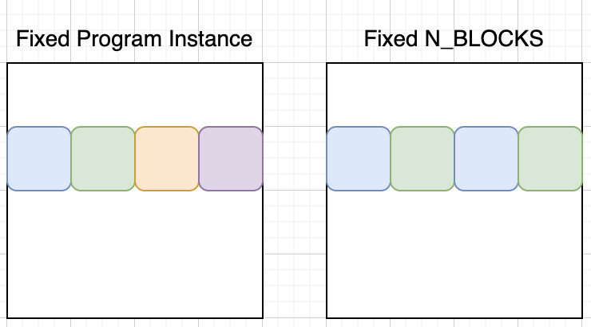

1. Bottomline is, every single tile should be covered by one program instance
2. Fixed program instance: 
   - Each program instance (block) covers a fixed amount of work
   - The total num of program instance (block) varies
3. Fixed N_BLOCKS:
   - The total num of program instance (block) is fixed
   - Each program instance will process one or multiple tiles 
4. Comparison
   - Fixed program instance seems easier to implement. Each of which only need to deal with one tile. The num of program instance can be easily specified through grid (e.g. `[cdiv(M, BLOCK_M), cdiv(N, BLOCK_N)]`)
   - One drawback of fixed program instance is that, it might result into a huge number of program instances (blocks). It may potentially cause extra scheduling overhead just like excessively num of threads in OS? don't really know.
   - So far it seems not much difference between those two approaches. Might be wrong though due to very limited experience

## Torch profiler annotation
- Each launched kernel in torch profiler has metadata including grid and block.
- `grid	[2097152, 1, 1]`: 1D grid is used, with in total 2097152 program instances (blocks)
- `block [64, 1, 1]`: each block contains 2 warps, or 64 threads

## Triton syntax
- `tl.debug_barrier`: 
  - Force to synchronize all threads in a block.
  - Needed when load/write the same pointer (global memory). But accessing local tensor is fine.
```
# loop_1
for off in range(0, N, BLOCK_N):
  cols = off + tl.arange(0, BLOCK_SIZE)
  tl.store(Out + cols, out, mask=mask)

tl.debug_barrier # otherwise it's possible that two threads within the same bloc, while one read (in loop_2) happens before the other write (in loop_1)

# loop_2
for off in range(0, N, BLOCK_N):
  cols = off + tl.arange(0, BLOCK_SIZE)
  t = tl.load(Out + cols, mask=mask)
```

- `tl.constexpr`
  - Indicates that a kernel argument is a compile-time constant.
  - This allows the compiler to perform optimizations such as unrolling loops and simplifying control flow, since it can generate specialized code paths for different constant values.

- `do_not_specialize`
  - Prevents the Triton compiler from generating specialized kernel variants for specific arguments.

- `tl.cumsum()`
  - Can be magical!
  - e.g. compute starting offset for each chunk of data, thus parallel the computation and store 
  - e.g. when combined with `tl.where()`
    - a list of elements, some of which satisfy some requirements while some do not
    - the goal is to reorder the list so that satisfying elements are placed at the beginning while others at the end
    - `locations = tl.cumsum(satisfied)`
    - `locations = tl.where(satisfied, locations, reversed_locations)`
- `tl.load()` & `tl.store()`
  - Pointers don't have to be consecutive. 
  - Precomputing a tensor as pointers can achieve purposed reordering
  
# Overlap Compute Streams
1. Does overlapping compute streams improve performance?
2. How does warp scheduling work?
3. How to measure SM utilizations?

## Experiment Results
`python benchmarks/benchmark_overlap_compute_streams.py`
- Matmul/Add (saturated kernels)
  - Overlapping streams yields similar performance to a single stream
- Sleep kernel (non-saturating)
  - Overlapping improves tput via concurrent executions

**matmul**

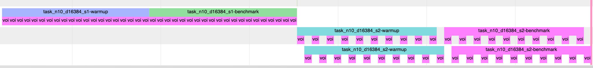

**add**

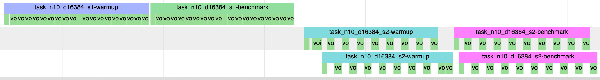

**sleep**

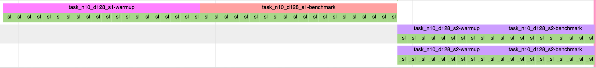


## CUDA execution hierarcy
Hardware perspective
- Warp: 32 threads, minimal execution unit (SIMT)
- SM
   - Hardware unit that executes warp
   - Each SM has warp schedulers, 2~4 per SM
   - Each warp scheduler issues instructions for one warp per cycle.
   - SM executes warps in interleaved fashion to hide memory latency.
- Block: goup of threads, decomposed into warps
- Grid: entire kernel launch

Software perspective
- Kernels in the same stream run sequentially
- Kernels in different streams may run concurrently, if resource constraints (e.g. SMs) allow
- The scheduler interleave kernels from different streams in a round-robin fashion, regardless of enqueue order

## Observibility
- `torch.cuda.Event.record()` is per stream (i.e. current stream)! Sync streams to allow multi-stream program latency measurement.
- Use `nsys profile --gpu-metrics-devices=all ...` to observe hardware metrics
  - `SM instructions` seems to be a good metrics for SM utiliztaion, where matmul is ~90%, add is ~10% and sleep is ~1%.
  - This also shows interesting metrics, e.g. DRAM bandwidth, NVLINK bandwidth, PCIe bandwidth, etc


# Numbers

## Bandwidth Test
1. HBM to SMEM
   - `python hbm_2_smem.py` 
   - H100: tested value: `2597GB/s`, reported value: `3TB/s`
2. Disk <> Host Mem
   1. Mem write to disk: `~500MB/s`
   2. Mem read from disk: `2~5GB/s`

- On H100
  - Dense matmul
    - [4k, 700] @ [700, 100k] ~1ms
    - [4k, 700] @ [700, 400k] ~4ms
  - Element-wise **kernel**
    - H100 memory bandwidth is 3TB
    - [4M, 480] (~8GB data read and then write) 8ms. Theoritical latency is 8/3000*2~=5ms


# D2D Local Memcpy
## Benchmarks


* nvbandwitdh: max tput is ~3TB/s
    * ./nvbandwidth -t device_local_copy
    * Only care about total tput. Uses tons of SMs
* pytorch copy: tput ~3TB/s 
    * For 1GB tensor copy_, grid: 1216, block: 256
* cuda memcpy:
    * Peak tput: 3.1TB/s overall, 47GB/s single SM
    * 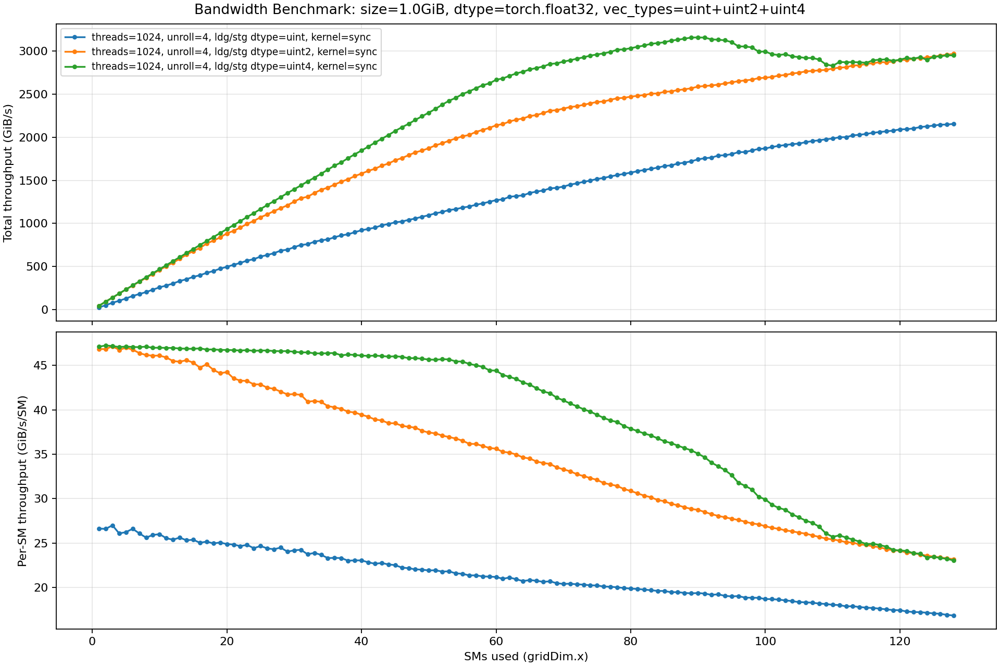


## Execution Flow


* Warp selection (SM front end)
    * Each SM has warp schedulers.
    * A scheduler selects a ready warp.
    * On GB200, each SM supports up to 64 resident warps
    * The warp issues a memory instruction (e.g. ld.global or st.global).
* Warp scheduling while memory is in flight
    * After issuing a load, a warp usually becomes “not ready” (waiting on memory).
    * The SM scheduler immediately switches to another ready warp.
    * This hides memory latency. The SM does not stall globally; only individual warps stall.
    * A SM usually has a limit on in-flight warps though
* Instruction issue
    * The instruction is decoded and issued.
    * For a load, the destination is registers.
    * For a store, the source is registers.
    * The instruction itself does NOT move data immediately.
* Load/Store Unit (LSU) — per-SM
    * Each SM has its own LSU pipelines - a per-SM resource, not shared across SMs
    * The LSU receives the memory instruction.
    * The LSU collects the per-thread addresses from the warp.
* Warp-level coalescing (LSU)
    * The LSU coalesces the 32 thread addresses into memory transactions.
    * Transactions are formed at cacheline / sector granularity.
    * Good alignment and contiguous accesses reduce transaction count.
* L1 cache (optional / instruction-dependent)
    * L1 cache is bypassed in ldg_cg instruction
* L2 cache — shared across all SMs
    * All global memory traffic goes through L2.
    * it buffer requests, merge traffic from many SMs, forward misses to memory partitions
    * L2 bandwidth is shared across all SMs.
* Memory partitions / HBM
    * On an L2 miss, the request goes to a memory partition.
    * HBM controllers schedule DRAM commands.
    * Data is fetched from HBM.
* Data return path
    * Data returns from HBM to L2.
    * From L2, data is routed back to the requesting SM.
    * The loaded data is written into registers.
    * 

## MLP - Memory Level Parallelism
- MLP means, how many independent memory operations can be in flight at the same time.
- The higher the MLP, the better you hide memory latency and the closer you get to peak bandwidth.
- Two components of MLP
  - Warp-level parallelism: More warps per SM → more independent memory ops
  - Instruction-level parallelism (ILP): larger unroll factor -> Multiple independent loads before using results
- Asynchronous-ness in memory instruction
  - When a warp gets blocked by a memory instruction, warp scheduler will immediately swap to another ready-to-run warp. The SM doesn't stall globally, only individual warps stall
  - A warp doesn't stall on a particular memory load instruction. It can issue multiple load instructions as long as they don't have dependencies. 

### Asynchronous
ldg() instruction is async as well. Example
```
v[0] = ldg(ptr0);
v[1] = ldg(ptr1);
```
That does NOT mean: load 0 fully completes, then Load 1 starts


Instead, what happens is:
1.	Warp issues ldg(ptr0)
2.	The request is sent to LSU → L2 → HBM/NVLink
3.	Register v[0] is marked pending in the scoreboard
4.	Warp moves to next instruction
5.	Warp issues ldg(ptr1)
6.	Another memory request is sent
7.	Register v[1] is marked pending


Now you have two outstanding loads. Nothing forces the second load to wait for the first one to return.


Now the limiting factors become
1.	how many registers can be pending
2.	how many outstanding loads per warp
3.	scoreboard tracking capacity

### cp.async
Why is cp.async needed at all then? And it does so:
1. without creating a register dependency
2.	without marking any register as pending
3.	without stalling the warp on scoreboard


The warp can continue issuing instructions even if the data hasn’t arrived yet.
Normal load:
-	Destination = register
-	Register is tracked by scoreboard
-	Any use of that register creates dependency


cp.async:
-	Destination = shared memory
-	No register dependency
-	No scoreboard tracking per register
-	Synchronization is explicit and group-based


This allows:
-	Much deeper in-flight request queues
-	Better control over when synchronization happens
-	Software pipelining between stages

## Profiling


* List all kernels
    * ncu --set none --target-processes all --print-summary per-kernel python -m mybandwidth.bench
* Replay and profile a particular kernel
    * ncu --set full --kernel-name mybandwidth_memcpy_sync_t1024_u4_vuint -o report_cuda_sm1_uint --target-processes all python -m mybandwidth.bench
    * After running ncu, tput never recovers. likely due to ncu will lock clock or power


## Bottleneck analysis


### Peak overall tput 3TB/s: bounded by global memory bandwidth
  * On GB200, HBM max tput is ~8TB/s bidirectional. 3TB/s read+ write is close to empirical limit
  * Both nvbandwidth and torch show 3TB/s upper bound
  * Also shown in ncu profiler
  * 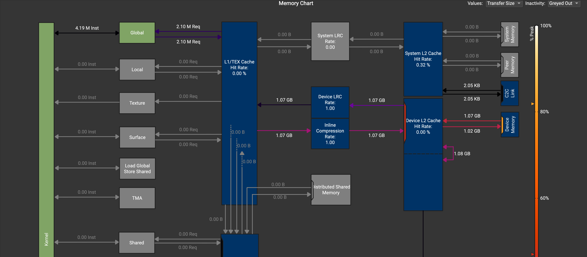

### Single SM hits at 47GB/s: bounded by LSU bandwidth
  * All SMs share L2 and HBM bandwidth, which wouldn’t be the bottleneck here
  * possible bottlenecks (assuming addresses can be well coelasced)
      * SM instruction issue rate (does SM issues sufficient instructions to saturate the LSU pipeline)
      * LSU bandwidth (each SM has its own LSU)
  * It’s not SM instruction issue rate bound because double the instruction issue rate got the same tput
      * Compare using uint, uint2 and uint4
          * python -m mybandwidth.bench --threads_list=[1024] --vec_type_list='["uint", "uint2", "uint4"]'
      * Ncu show 2x instructions

  * 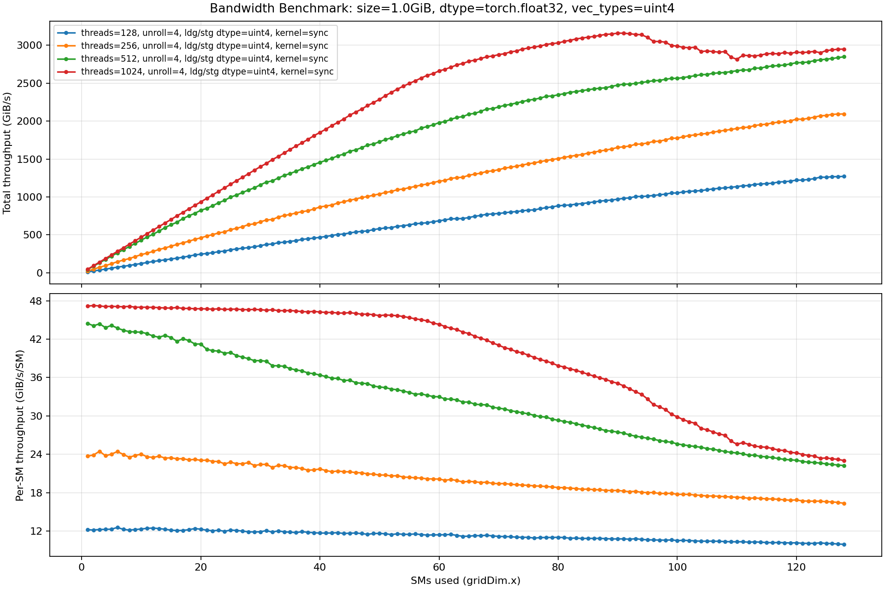
  * For uint case, single SM tput is ~27GB/s. Likely bound by SM instruction issue rate

### Single SM with smaller num of threads: likely bounded by per-warp instruction issue rate
  * py -m mybandwidth.bench --print_table=True --threads_list='[1024, 896, 768, 640, 512, 256]'

  * 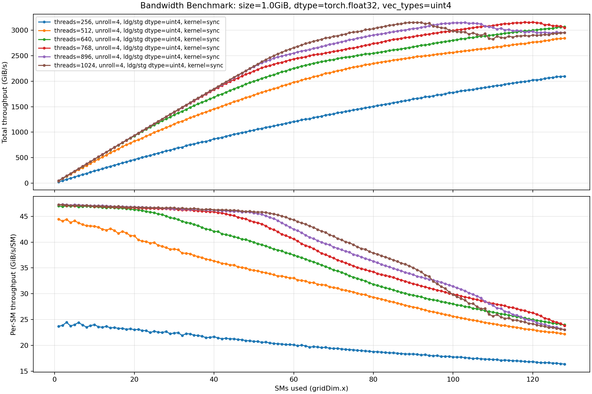

  * For single SM, with n_threads=1024, 896, 768, 640, they all have similar tput ~47GB/s
      * They are LSU bandwidth bound
  * For single SM with 512 threads, it’s per-warp instruction issue rate bound
      * A SM doesn’t have sufficient in-flight warps running, to issue enough instructions to saturate LSU 
  * 256 threads has ~half of the 512 threads tput

### Per-SM tput decreases with more SMs
  * All SMs share the same L2 and HBM 
  * Resource contention results into higher latency.
  
### Per-SM tput decreases faster with more SMs for n_threads=512 than n_threads=1024
  * py -m mybandwidth.bench --threads_list='[512, 1024]'
  * 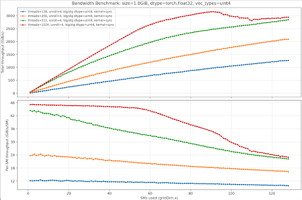
  * More SMs -> higher contention in L2/HBM -> higher latency
    * 1024 threads have more warps -> higher MLP -> more stable under contention
    * 512 threads have less warps. more sensitive to contention (increasing of latency)
  * Increasing unroll factor can increase MLP as well
    * 512 threads with 2x unroll factor achieved close tput as 1024 threads
    * py -m mybandwidth.bench --threads_list='[512, 1024]' --unroll='[1,2,4,8]'
    * 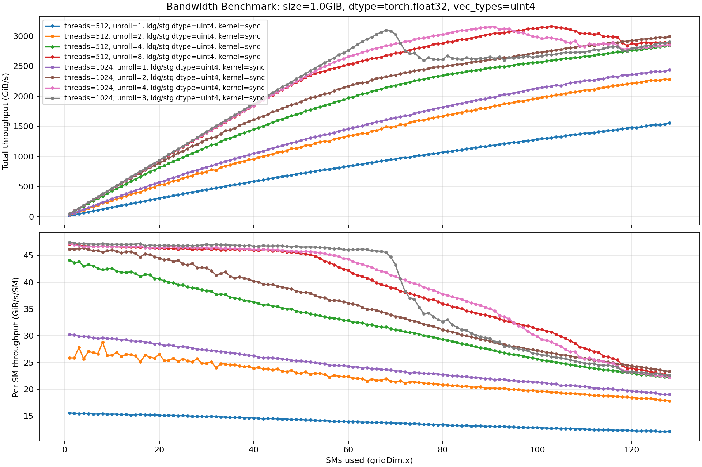 
  * With n_threads=1024 unroll=8, we hit stable per-SM tput until reach HBM limit
    * py -m mybandwidth.bench --threads_list='[512, 1024]' --unroll='[1,2, 4, 8,12, 16, 32]'
    * 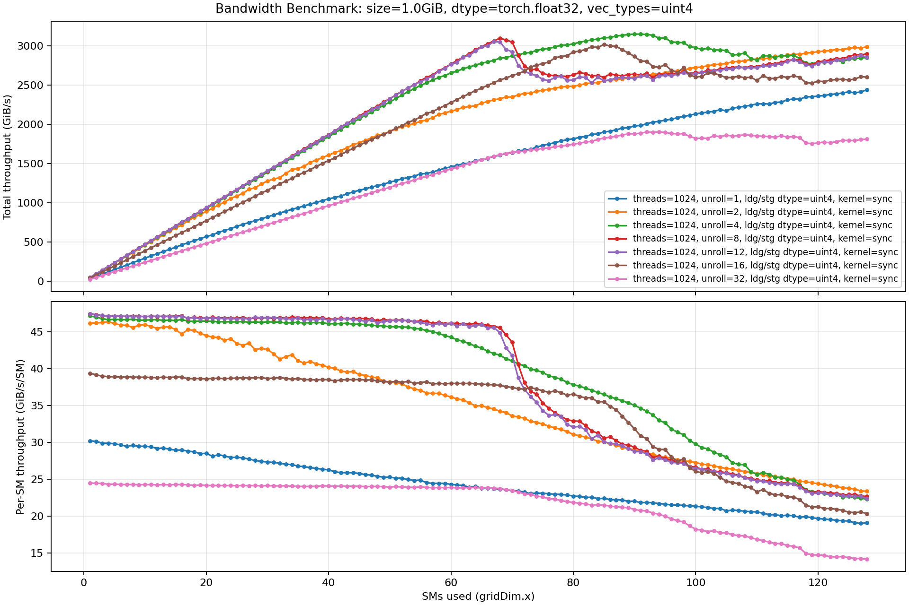


## Cuda d2d optimization


* Unroll factor
    * Little difference as long as unroll factor >=2
    * py -m mybandwidth.bench --print_table=True --threads_list='[1024]' --unroll='[1,2,4,8]'
    * With larger unroll factor, it increases MLP, thus more stable under contention. Checkout section above for details
    * 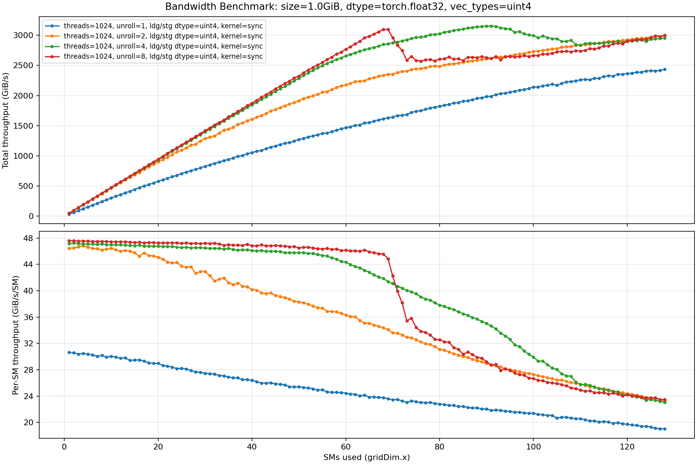

* cp.async
    * py -m mybandwidth.bench --print_table=True --threads_list='[1024]' --kernel_mode=both
    * 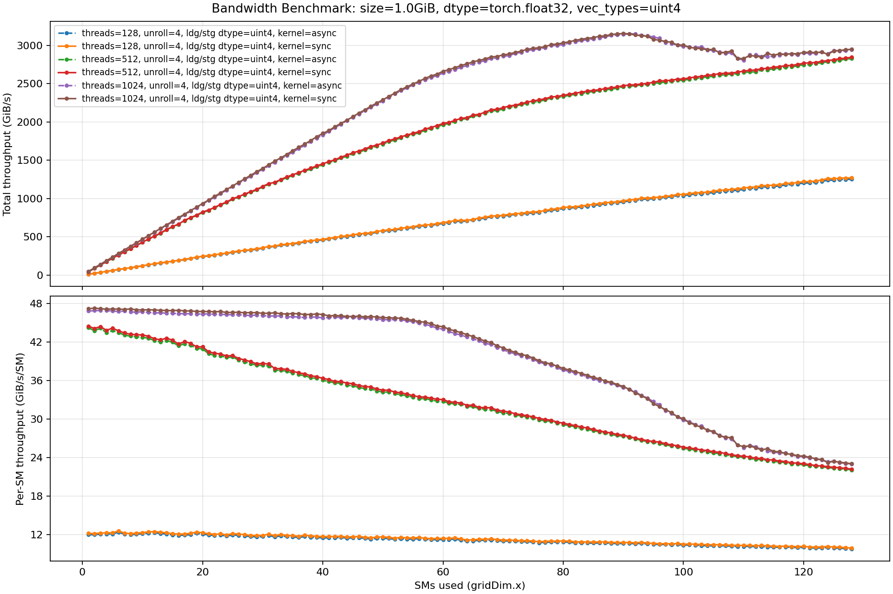

    * Little difference
        * cp.async allows warp to issue memory instructions while not waiting for response
        * Though even with sync load/store, a waiting warp will be swapped out. So no extra latency as well
        * cp.async can be usually for overlapping memory and compute
    * py -m mybandwidth.bench --print_table=True --threads_list='[128, 512, 1024]' --kernel_mode=both
        * same results
* Tiling
    * Similar tput, due to warp level coalescing 
* Big grid x small block VS small grid x big block


# D2D memcpy nvlink

## Execution Flow
* Same as local memcpy, SM issues the copy instruction, LSU coalesces the request into memory transitions, and forwards to L2 cache
  * The destination pointer refers to peer GPU memory mapped via CUDA P2P.
* L2 identifies the request as targeting a remote GPU.
  * Instead of forwarding to local memory partitions, L2 routes the request to the NVLink interface.
  * L2 still buffers, merges, and arbitrates requests from all SMs.
  * NVLink replaces the local L2 → HBM path with L2 → NVLink → peer GPU.
* Transport latency is higher than local HBM but is hidden by warp scheduling
* No SM execution is involved on the destination GPU for naive remote writes

## Bottleneck Analysis
* Single SM hits 47GB/s, exactly the same as local memcpy, as expected, due to bound by LSU (a per-SM resource)
  * 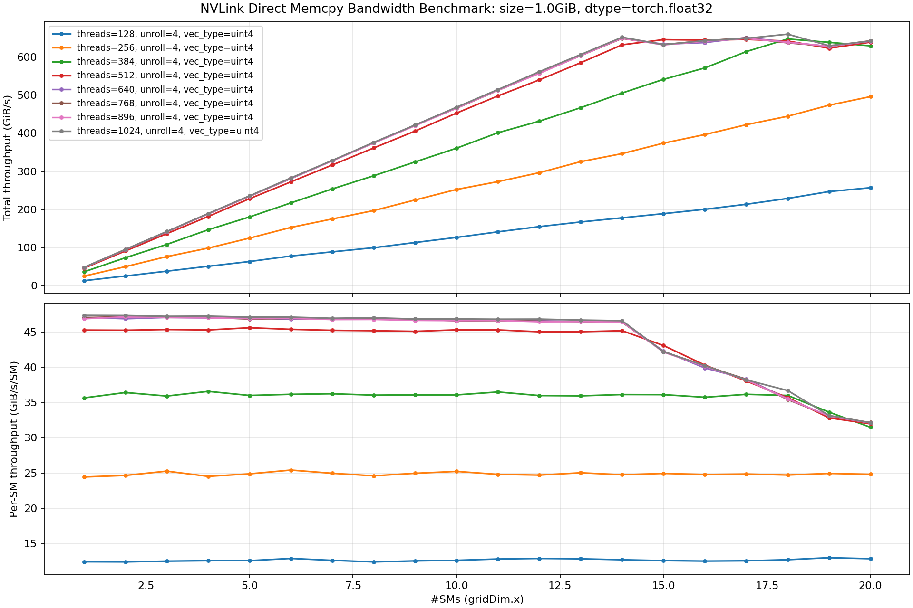
  * n_threads < 512 is most likely bound by instruction issuing speed
* Shared resource contention is stronger than HBM, likely due to smaller Nvlink bandwidth
  * 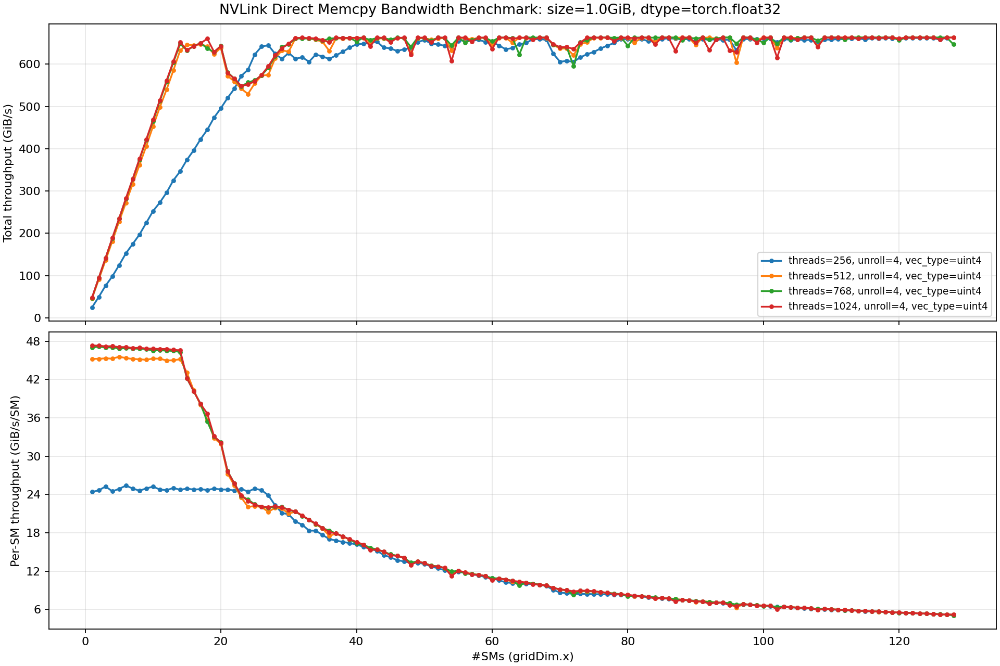
* Overall bandwidth can hit ~670GB/s
  * nvbandwidth hits ~710GB/s
```
./nvbandwidth -t device_to_device_bidirectional_memcpy_write_sm
Running device_to_device_bidirectional_memcpy_write_sm.
memcpy SM GPU(row) <-> GPU(column) Write1 bandwidth (GB/s)
           0         1         2         3
 0       N/A    706.85    707.31    707.78
 1    694.22       N/A    706.27    706.62
 2    694.22    705.98       N/A    706.44
 3    693.99    706.21    706.38       N/A
```

  * Tried various optizations, e.g. unroll factor, bidirectional mode, barrier overhead, cuda graph, etc. But it turns out the difference is from unit computation, 1^30 vs 1e9.

# D2D memcpy nvlink handshake

## Single SM tput 


* `total_time = n_iter * time_per_iter`
* `n_iter = n_bytes / (n_channels * staging_buf_size_per_channel)`
* `time_per_iter = memcpy remote + signal + memcpy local + signal`
    * Or, `memcpy remote + signal`, when using rotation buffer


### n_channels


* mpirun -n 2 python -m memcpy_nvlink_handshake.bench  --n_threads_list='[256, 512, 1024]'  --channels_per_cta_list='[1,2,4,8,16, 32]' --n_ctas_list='[1, 2, 3, 4, 5, 6, 7, 8, 9, 10, 11, 12, 13, 14, 15, 16, 17, 18, 19, 20, 21, 22, 23, 24, 25, 26, 27, 28, 29, 30, 31, 32, 33, 34, 35, 36, 37, 38, 39, 40]'
  * 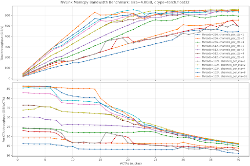

* Larger num channels, the higher tput: reduces n_iter -> reduce the fixed overhead from signal


### Staging buf size


* mpirun -n 2 python -m memcpy_nvlink_handshake.bench  --n_threads_list='[1024]'  --channels_per_cta_list='[2]' --n_ctas_list='[1, 2, 3, 4, 5]'  --staging_buf_size_per_channel_list='[65536,131072,262144,524288]'
  * 
* Effectively equal to increase the num of channels

### cp.async
* Little impact
* ldg/stg are asynchronous by its nature already


### Rotation buffer


* rotation buffer ~2x the tput
* mpirun -n 2 python -m memcpy_nvlink_handshake.bench  --n_threads_list='[1024]'  --channels_per_cta_list='[2]' --n_ctas_list='[1, 2, 3, 4, 5]'  --staging_buf_size_per_channel_list='[65536,131072,262144,524288]' --rotation_buffer=True
  * 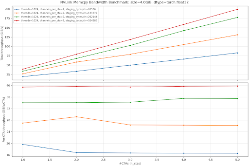
  * 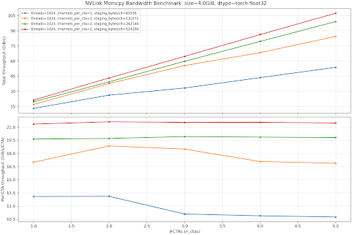


## Total tput

* n_thread=1024, n_channels=8, n_unroll=8, staging_buf=256K
  * 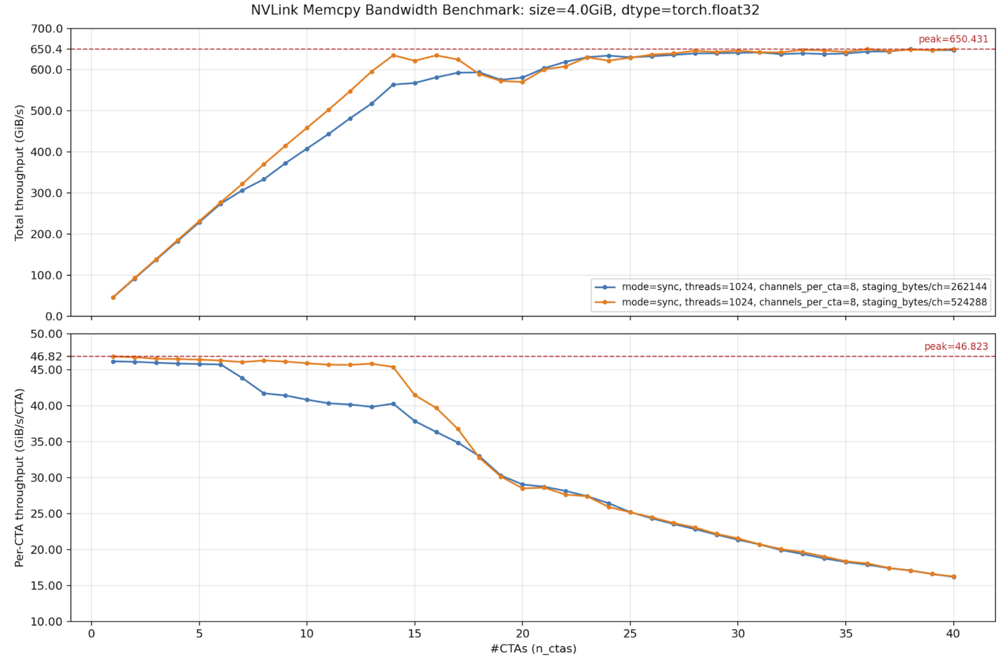

* [TODO] 650GB/s vs memcpy nvlink 660GB/s