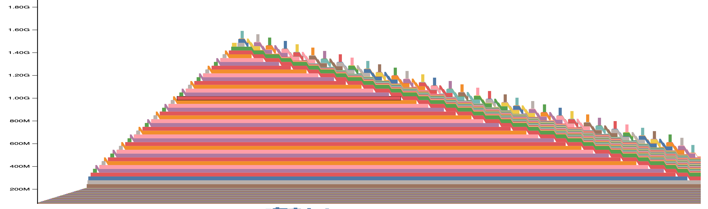
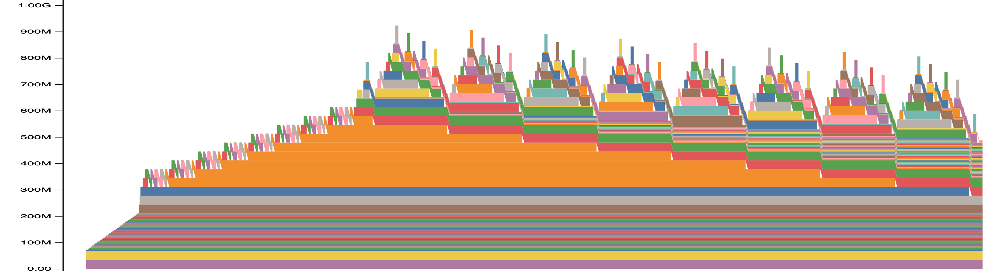
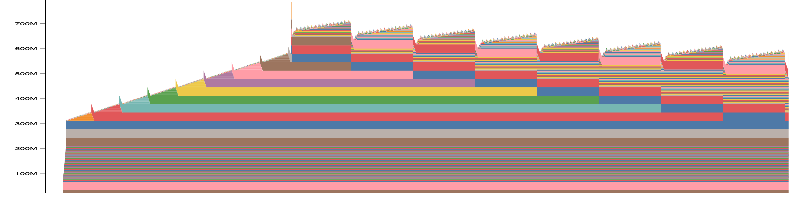
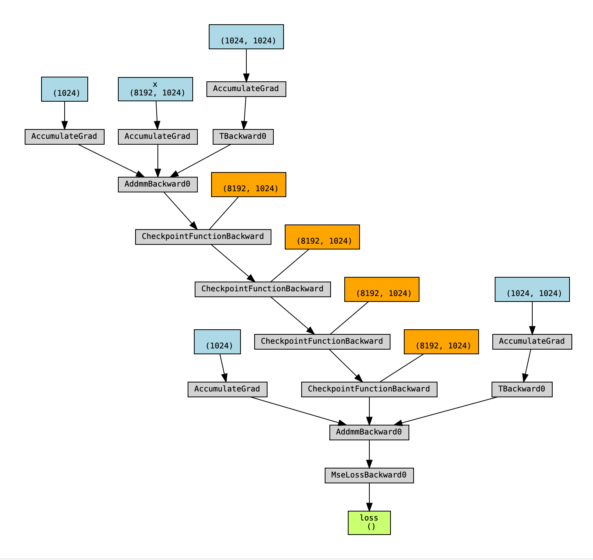
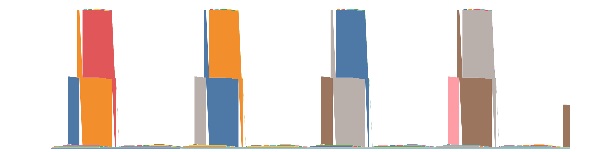
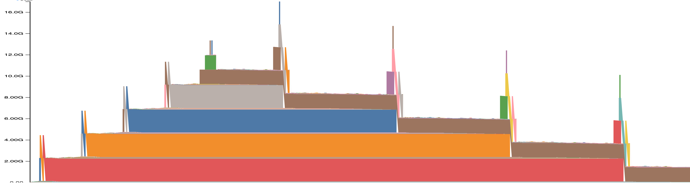
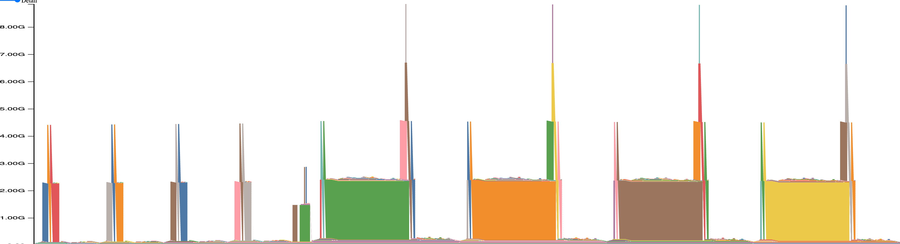

# Table of Content
- [Table of Content](#table-of-content)
- [CUDA Memory Management](#cuda-memory-management)
  - [Links](#links)
  - [Cuda](#cuda)
  - [PyTorch CudaCacheAllocator (CCA)](#pytorch-cudacacheallocator-cca)
  - [Monitoring](#monitoring)
- [Activation Checkpointing](#activation-checkpointing)
  - [Under the hood](#under-the-hood)
  - [Autograd engine](#autograd-engine)
  - [Peak memory](#peak-memory)
  - [Toy implementation](#toy-implementation)
- [Nano-Batching](#nano-batching)
  - [Under the hood](#under-the-hood-1)
  - [Peak memory analysis](#peak-memory-analysis)
  - [Toy implementation](#toy-implementation-1)
- [Autograd \& Computation graph](#autograd--computation-graph)
  - [Concepts](#concepts)
  - [Data structure](#data-structure)
  - [tensor.detach()](#tensordetach)
  - [Visualization](#visualization)
  - [Autograd `backward()` output semantics](#autograd-backward-output-semantics)
- [CUDA Memory Usage](#cuda-memory-usage)
  - [Forward only](#forward-only)
  - [Foward backward](#foward-backward)
  - [Forward backward with activation checkpointing](#forward-backward-with-activation-checkpointing)

# CUDA Memory Management

## Links
- Gentle intro to memory management. A great one!
    - https://dev-discuss.pytorch.org/t/fsdp-cudacachingallocator-an-outsider-newb-perspective/1486
- PyTorch cuda cache allocator internal details
    - https://zdevito.github.io/2022/08/04/cuda-caching-allocator.html 
- PyTorch CUDA mem usage
    - https://pytorch.org/docs/stable/torch_cuda_memory.html
- Visualize mem profile
    - https://pytorch.org/memory_viz

## Cuda 
(so-heard knowledges)
1. `cudaMalloc()` and `cudaFree()` are host-side functions. Synchronous functions. Don't issue kernels that run on Cuda streams.
    - It imples Cuda memory is managed by runtime library running on Cpu side. Device executes computation upon whatever addresses it receives

2. `cudaMalloc()` is not that slow, just directly claims a unused memory.
3. `cudaFree()` triggers a device synchronization, waiting for all cuda ops completion across streams.

## PyTorch CudaCacheAllocator (CCA)
1. Single stream case is simple. All of the tensor allocation and deallocation happen on Cpu without any synchronization needed. Gpu operations runs on Cuda queue following the exactly same order. 

2. CCA creates one-pool-per-stream. When no cross stream tensor access, the case is as simple as single stream.

3. Cross stream tensor access without proper synchronization yields to race condition. See example below.

4. `tensor.record_stream()`: tensor's deallocator won't immediately free the underlying memory. It instead saves the event info of recorded stream into tensor's (or some CCA's) metadata. During a later `malloc`, CCA will evaluate if this block of memory is reusable based on event's status. 

5. Besides `tensor.record_stream()`, introducing stream level synchronization is another way to avoid race condition. 

6. During malloc if there is not enough contiguous free memory block in CCA to allocate, (might due to fragementation) it triggers a `cudaFree()`. It returns all the unused memory back to Cuda. Cuda is able to reshuffle those noncontiguous memory to contiguous blocks by virtual memory remapping! It 
    - When this happens, it could significantly hurt the perf due to device synchronization.
    - If not enough memory available even after `cudaFree()`, OOM exception will be raised
    - Takeaway: eagerly allocate major memory ahead of time if possible, e.g. params and grads in a layer, instead of a frequently allocate and free on the fly.

```
import torch
import triton
import triton.language as tl


@triton.jit(do_not_specialize=["duration"])
def _sleep(duration):
    start = tl.extra.cuda.globaltimer()
    while tl.extra.cuda.globaltimer() - start < duration:
        pass


def sleep(duration: float):
    _sleep[(1,)](int(duration * 1e9))


N = 10
AVOID_RACE_CONDITION_BY_RECORD_STREAM = False
AVOID_RACE_CONDITION_BY_STREAM_SYNC = False

s1 = torch.cuda.Stream()
s2 = torch.cuda.Stream()


for i in range(N):
    with torch.cuda.stream(s1):
        x = torch.full((1024,), 1, device="cuda", dtype=torch.float32)
        # Without this line, the first iteration may succeed. From ChatGpt:
        # "Without the in-place operation, x's data might not be fully allocated
        # or utilized in the same way. The memory allocator may decide not to
        # reuse x's memory immediately because it wasn't actively used.
        x *= 2
        evt = torch.cuda.current_stream().record_event()

    with torch.cuda.stream(s2):
        sleep(1)
        torch.cuda.current_stream().wait_event(evt)
        y = x * 3

    if AVOID_RACE_CONDITION_BY_RECORD_STREAM:
        x.record_stream(s2)
    
    if AVOID_RACE_CONDITION_BY_STREAM_SYNC:
        s1.wait_stream(s2)

    # Allocating a new tensor with the same size on the same stream will reuse
    # the memory freed by x, thus triggering the race condition.
    del x
    with torch.cuda.stream(s1):
        c = torch.full((1024,), 31, device="cuda", dtype=torch.float32)
    torch.cuda.synchronize()

    expected = torch.full((1024,), 6, device="cuda", dtype=torch.float32)
    print(f"iter {i} {torch.equal(y, expected)=}")

```
## Monitoring
1. `torch.cuda.memory_allocated()` and `torch.cuda.memory_allocated()`
2. `torch.cuda.memory_allocated()` will count a memory as freed as long as tensor is deleted, without considering if it's recorded on another stream.
3. `torch.cuda.memory._record_memory_history()` to track runtime memory allocation history overtime with stacktrace. 
    - https://pytorch.org/docs/stable/torch_cuda_memory.html


# Activation Checkpointing
## Under the hood
1. In a normal forward pass, each operation (i.e. torch.autograd.Function) save inputs (e.g. activations from previous ops) into ctx for backward pass
2. Activation checkpointing creates a new torch.autograd.Function as a wrapper, wraps usually a bunch of operations as a group.
3. In forward method, `torch.no_grad()` is used, and only the input to the first op is saved to ctx, but none of the intermediate activations
4. Externally, only this wrapper op is tracked by the computation graph.
4. In backward method, re-run the forward on this operation group, which builds the local computation graph with all the needed intermediate activations. 
5. Then backward method runs backward on this local computation graph, and returns the gradients for the original input.
6. Outter computation graph will continue backward with returned gradients


## Autograd engine
- In forward pass, operations within the checkpoint group won't be tracked by computation graph
- In backward pass, build a local computaion graph on-the-fly, compute and assign gradients within the group

## Peak memory
- Instead saving all the activations, only activations at the boundary of checkpointing will be saved
- Intermeidate acitivation will be regenerated during backward pass, one checkpointing at a time though
- Let's say we have a model with N layers, each layer has X bytes of final activation and Y extra bytes for the full activation, the memory usage would be 
  - Without activation checkpointing: (X+Y) * N
  - With activation checkpoiting every layer: X * N + Y
  - With activation checkpointing every M layers: X * (N/M) + X * (M-1) + Y * M

## Toy implementation
```
$ python tiny_checkpoint.py
no_op peak memory: 940.07 MB
toy peak memory: 688.08 MB
torch peak memory: 688.08 MB
```

# Nano-Batching
## Under the hood
1. Similar to activation checkpointing, yet another approach to save GPU memory
2. By subdividing microbatches further into nanobatches at the most memory-intensive layers, it reduces peak memory usage.
3. Instead of storing full intermediate activations, only a chunk is computed and stored at a time, running fwd followed by immediate backward.

## Peak memory analysis

Consider a model with N layers, where each layer produces: X bytes of input activations, Y bytes of intermediate activations

1. Vanilla model: 
   1. All activations, both input and intermediate, are stored throughout the forward pass to support backward
   3. Peak usage: N * (X + Y)
   4. 
2. Activation checkpointing:
   1. All input activations are retrained
   2. Intermediate activations are recomputed as needed, so **only one full intermediate tensor is held at any given time**
   3. Peak usage: N * X + Y
   4. 
3. Nanobatch:
   1. All input activations are retrained
   2. Intermediate activations are recomputed but in smaller chunks, thus **only a fraction of an intermediate tensor is held at any one time**
   3. Peak usage: N * X + Y / N_CHUNKS
   4. 

Check out `./nanobatch_mem_profile` for original mem profiles.


## Toy implementation
```
$ py tiny_nanobatch.py
################################################################################
Testing correctness
vanilla vs ckpt: match
vanilla vs nano: match
vanilla vs nano2: match
################################################################################
Testing memory usage
Peak memory usage [vanilla]: 1516.14 MB
Peak memory usage [ckpt]: 880.14 MB
Peak memory usage [nano]: 748.14 MB
Peak memory usage [nano2]: 748.14 MB
```


# Autograd & Computation graph

## Concepts
1. A computation graph represents how tensors flow through operations during forward pass and backward passes.
2. PyTorch constructs the graph on-the-fly when running forward pass.
3. Tensors are the nodes in the graph
4. Operations are the edges connecting the nodes.

## Data structure
After running forward pass, autograd engine builds the computation graph by
- Each tensor (with `requires_grad=True`) has a associated `.grad_fn` attribute, which is responsible to compute and assign grads for its input tensors.
- Each `.grad_fn` has a associated `.next_functions`, each of which element is another `.grad_fn` along the chain
- Traversing from `loss.grad_fn` and invoke `.grad_fn` on the chain will compute and assign grads for all the tensors along the chain

## tensor.detach()
- Creates a new tensor that shares the same storage but detached from the computation graph
- Sharing the same storage means no new memory allocation.
- The newly created tensor will not require grads, even if the original does.
- The detached tensor won't have grad_fn attribute, and isn't part of the computation graph.

## Visualization
- Run `python tiny_checkpoint.py` with `ENABLE_COMPUTATION_GRAPH_VIZ_DOT=True` to inspect the computation graph.
- 

## Autograd `backward()` output semantics
- `python x/autograd_fn.py`
- Autograd engine uses return values from backward() function to assign grad to input tensors
When you implement a custom `torch.autograd.Function`, the tensors you return from `backward()` can be handled three different ways:

1. Fresh tensors created inside `backward()`  
   - `.grad` was `None`  
   - PyTorch assigns your new tensor directly as `.grad` (no copy but create a new tensor object) 
   - storage pointer matches your returned tensor  

2. Tensors created before or outside `backward()`  
   - `.grad` was `None`  
   - PyTorch allocates its own buffer and copies your values in (`.copy_()`)  

3. `.grad` buffer already exists on the tensor  
   - PyTorch performs an in‑place add (`+=`) into the existing `.grad`  

4. Input with `requires_grad=False`  
   - no gradient is tracked or applied  
   - `.grad` remains `None` for that input  

5. Graph propagation and hooks  
   - If an input has a computation history, the output tensor will be directly passed down to the backward computation of that computation graph
   - The behavior can be monitored by `register_hook()`


# CUDA Memory Usage

## Forward only
1. Tensor types by life span
   1. Within an op
      1. Kernel intermeidate tensor: allocated and freed within the scope of kernel
   2. Within a line
      1. `x = fn(x)`: freed after reassignment
   3. Within a function
      1. Unique variables in a function, and potentially return to next func
2. Mem graph pattern
   1. Up down and up down due to frequent tensor reassignment
   2. In the simplest case, at most 2 tensors are alive, and only 1 tensor alive in most times
3. Profiling: `python x/memory_usage.py --mode=fwd_only`

    `Peak memory usage during forward pass: 4.11 GB`



## Foward backward
1. which activation will have long-lasting lifetime, i.e. saved in ctx for bwd?
    1. the ones used in the bwd, e.g. the activation in bmm if the other operand requires grad
    2. NB, softmax doesn't requires to store the input activation but output activation
2. Mem graph pattern
   1. fwd: up up up (saving activations in ctx)
   2. bwd: up down up down (creating and freeing intermediate grad tensor for activations)
   3. bwd: down down down (free saved activations in ctx)
3. Profiling: `python x/memory_usage.py --mode=fwd_bwd`

    `Peak memory usage during forward-backward pass: 15.83 GB`



## Forward backward with activation checkpointing
1. Only input for each checkpointing block is saved, but not the full intermediate activations
2. Mem graph pattern
   1. fwd: up (up down) up (up down) (checkpointing block doesn't require grad)
   2. bwd: down (up down) down (up down) (recompute intermediate activations within each checkpointing block before backward)
3. Profiling: `python x/memory_usage.py --mode=fwd_bwd`

    `Peak memory usage during forward-backward pass with activation checkpointing: 8.24 GB`
4. OPEN QUESTION: why those pointy spikes???

